Here you can browse a selection of Tekne's creative collaborations. If you're on a desktop computer, feel free to use the sidebar on the left to navigate between different categories.

Want to be our next collaborator? <a href="{{ '/contact/' | relative_url }}" class="button">Contact us!</a>

## <b> Testimonials </b>

Hear from some of the people we've worked with:

<section class="grid grid--small home-highlights">
  

    <a href="{{ '/portfolio/chris/' | relative_url }}">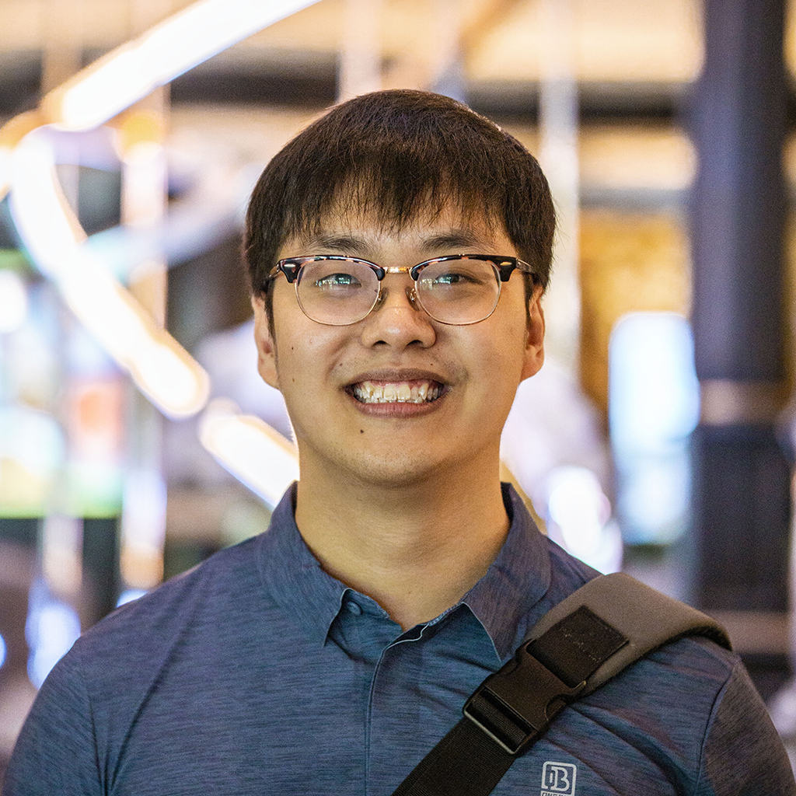</a>
    <a href="{{ '/portfolio/chris/' | relative_url }}"><h3><b>Christopher L.</b></h3></a>
  

  

    <a href="{{ '/portfolio/grant/' | relative_url }}">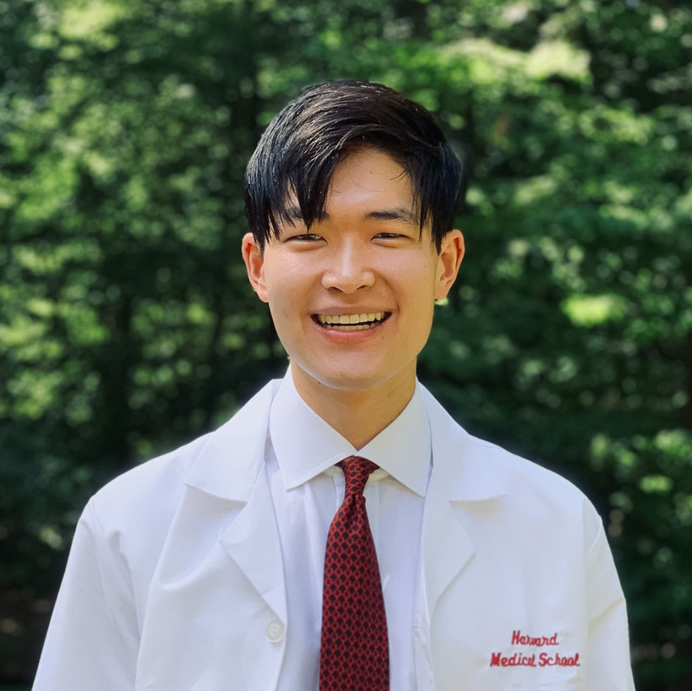</a>
    <a href="{{ '/portfolio/grant/' | relative_url }}"><h3><b>Grant R.</b></h3></a>
  

  <!-- 

    
    <h3><b>Placeholder</b></h3>
  
 -->
</section>

---

## <b> Performing Arts </b>

There is no better way to connect with others than through shared experiences. These samples demonstrate how we create performing arts experiences specially tailored to our audiences' needs.

<section class="grid grid--small home-highlights">
  

    <a href="{{ '/portfolio/spring/' | relative_url }}">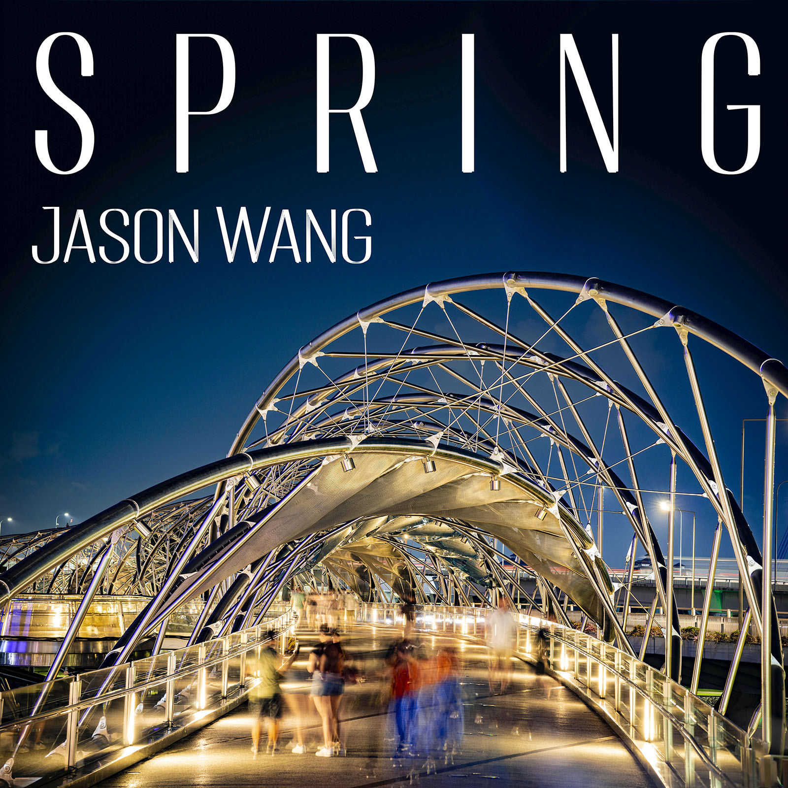</a>
    <a href="{{ '/portfolio/spring/' | relative_url }}"><h3><b>Spring: A Violin Album</b></h3></a>
  

  

    
    <a href="{{ '/portfolio/dcc/' | relative_url }}"><h3><b>MGH Dementia Care Collaborative</b></h3></a>
  

  

    
    <a href="{{ '/portfolio/vbc/' | relative_url }}"><h3><b>Virtual Bedside Concerts</b></h3></a>
  

</section>

<section class="grid grid--small home-highlights">
  

    <a href="{{ '/portfolio/cmmc/' | relative_url }}">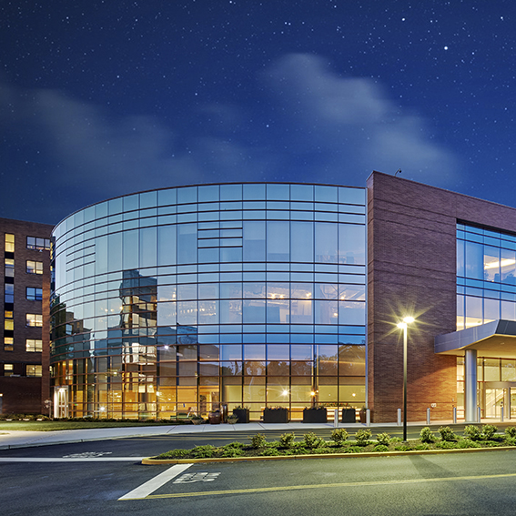</a>
    <a href="{{ '/portfolio/cmmc/' | relative_url }}"><h3><b>Clara Maass Medical Center</b></h3></a>
  

  

    
    <a href="{{ '/portfolio/jing/' | relative_url }}"><h3><b>精: The Destination is The Journey</b></h3></a>
  

  

    <!-- 
    <h3><b>Placeholder</b></h3> -->
  

</section>

---

## <b> Music Compositions </b>

We strive to create music that shows people the better world that we wish to see. Our compositions are driven by social impact: helping people better understand what they previously couldn't, and spotlighting the precious pieces of good within our lives.

<section class="grid grid--small home-highlights">
  

    <a href="{{ '/portfolio/tidal/' | relative_url }}">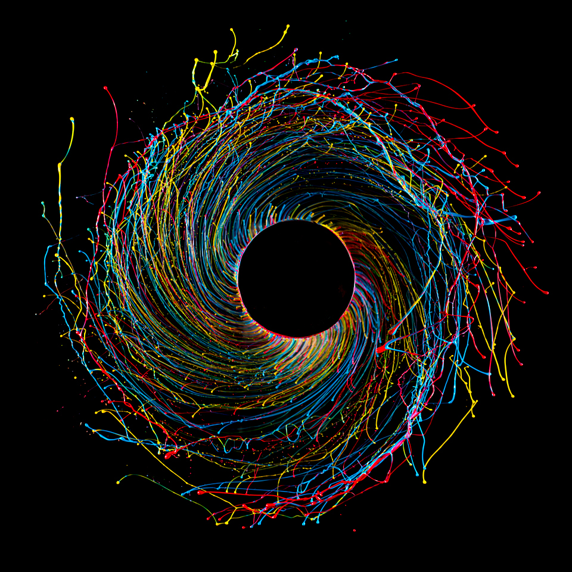</a>
    <a href="{{ '/portfolio/tidal/' | relative_url }}"><h3><b>Tidal Force</b></h3></a>
  

  

    <a href="{{ '/portfolio/sugi/' | relative_url }}">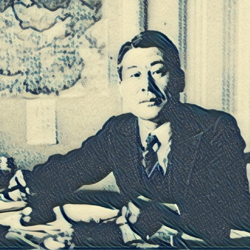</a>
    <a href="{{ '/portfolio/sugi/' | relative_url }}"><h3><b>勇敢に立ち向かう: Sugihara's Story</b></h3></a>
  

  

    
    <a href="{{ '/portfolio/voice/' | relative_url }}"><h3><b>A Voice for the Voiceless</b></h3></a>
  

</section>

<section class="grid grid--small home-highlights">
  

    <a href="{{ '/portfolio/athens/' | relative_url }}">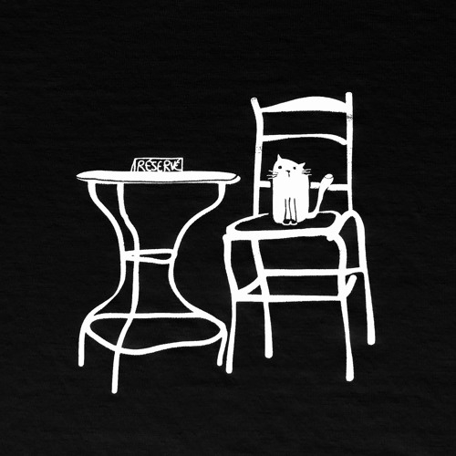</a>
    <a href="{{ '/portfolio/athens/' | relative_url }}"><h3><b>Athens Curatorial Project</b></h3></a>
  

  

    <a href="{{ '/portfolio/hwahae/' | relative_url }}">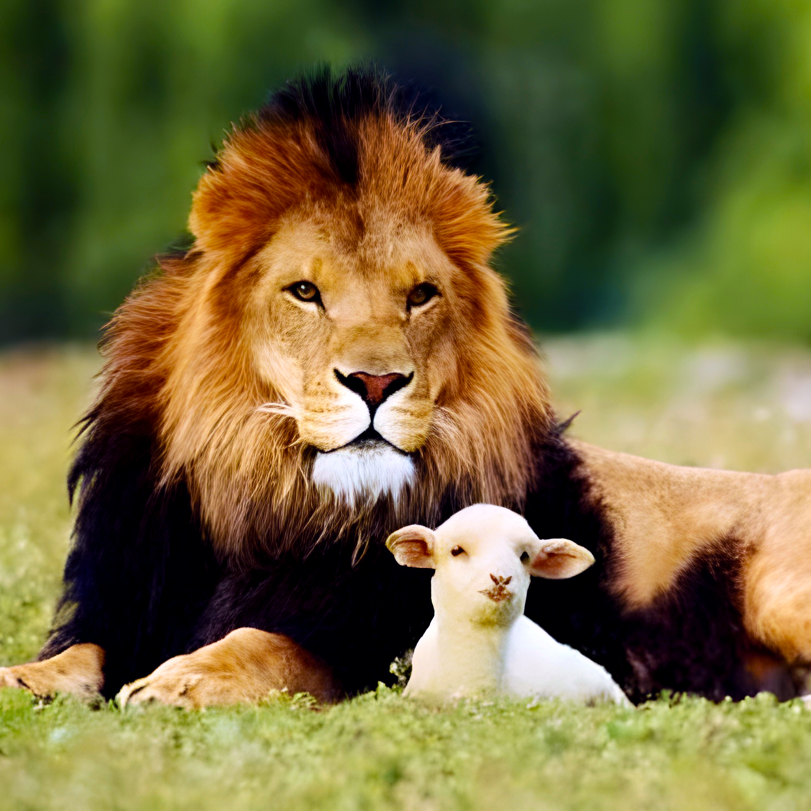</a>
    <a href="{{ '/portfolio/hwahae/' | relative_url }}"><h3><b>화해: Reconciliation</b></h3></a>
  

  

    <!-- 
    <h3><b>Virtual Bedside Concerts</b></h3> -->
  

</section>

---

## <b> Video Production </b>

Films and animations have the unique power to turn dreams into reality. By collaborating with us on a film, we can breathe vivid life into your existing ideas, and spark some new ideas within you as well.

<section class="grid grid--small home-highlights">
  

    <a href="{{ '/portfolio/tll/' | relative_url }}">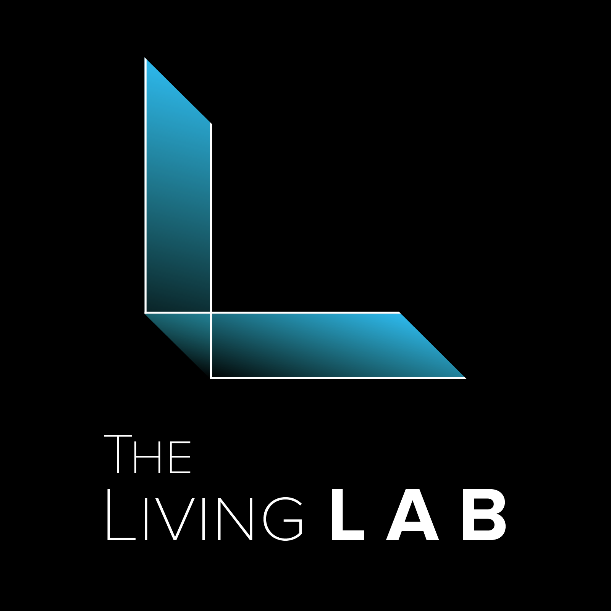</a>
    <a href="{{ '/portfolio/tll/' | relative_url }}"><h3><b>The Living Lab</b></h3></a>
  

  

    <a href="{{ '/portfolio/beta1/' | relative_url }}">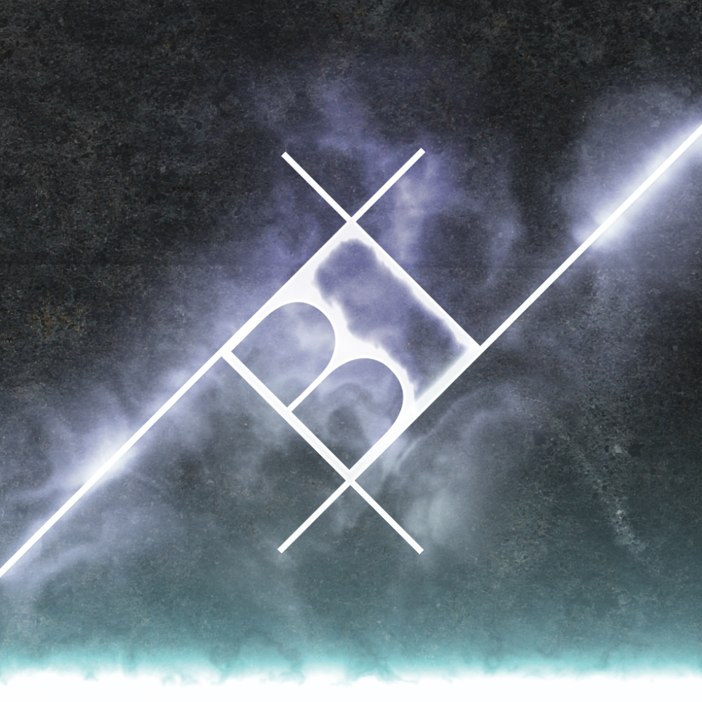</a>
    <a href="{{ '/portfolio/beta1/' | relative_url }}"><h3><b>Beta–1 Studios</b></h3></a>
  

  

    <!-- 
    <h3><b>Placeholder</b></h3> -->
  

</section>

---

## <b> Photography </b>

For us, photography is not just a tool. A photography session at Tekne is collaborative: we work with you to tell your unique story, whatever form that may take, so that you are involved deeply in our creative process. As such, every photography session is different depending on the client. However, these samples will give you an idea of our quality and style:

<section class="grid grid--small home-highlights">
  

    
    <a href="{{ '/portfolio/portrait/' | relative_url }}"><h3><b>Portraits</b></h3></a>
  

  

    
    <a href="{{ '/portfolio/street/' | relative_url }}"><h3><b>Street Photography</b></h3></a>
  

  

    <a href="{{ '/portfolio/nature/' | relative_url }}">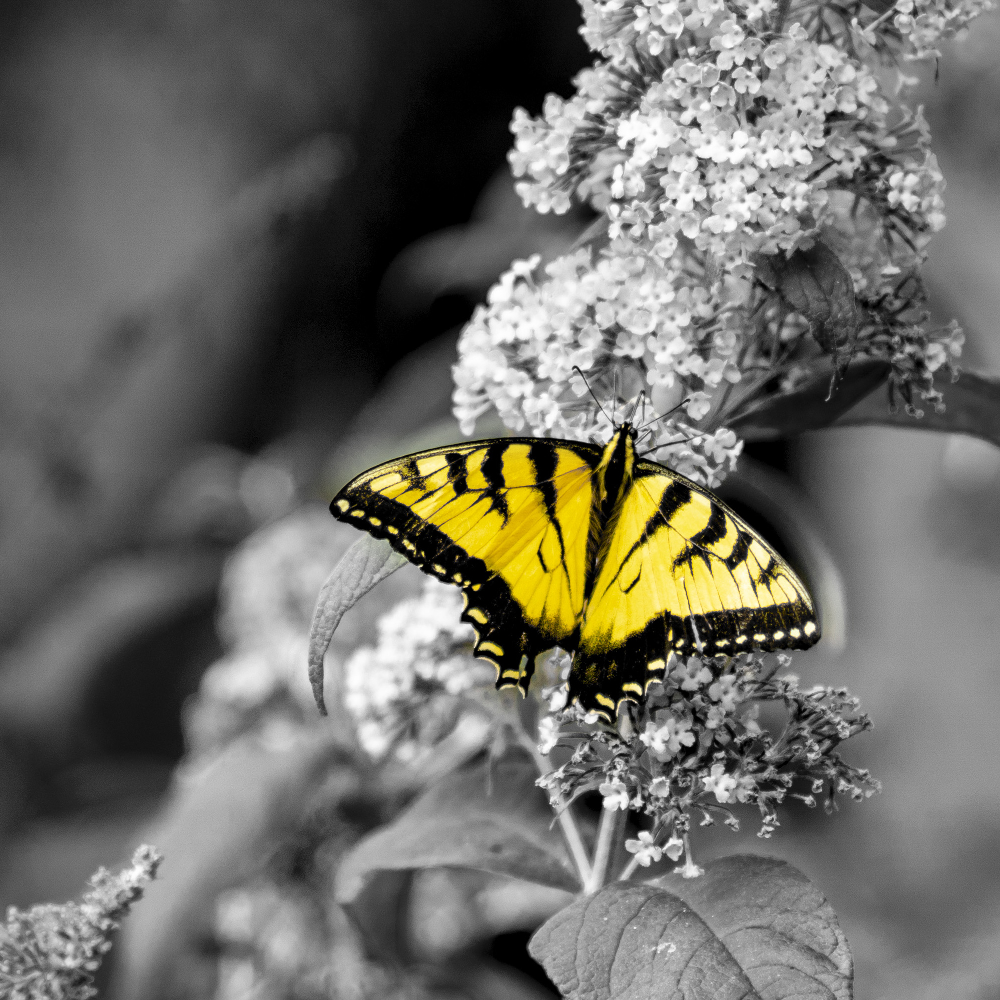</a>
    <a href="{{ '/portfolio/nature/' | relative_url }}"><h3><b>Nature</b></h3></a>
  

</section>

<a href="{{ '/about/' | relative_url }}" class="button"><b>About</b></a><a href="{{ '/contact/' | relative_url }}" class="button"><b>Contact</b></a>
